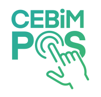

# CebimPOS

Ticari hayatın en önemli ödeme araçlarından biri olan POS cihazlarının cep telefonlarına taşındığı mobil uygulamadır. Klasik POS cihazlarıyla yapılan tüm işlemler, CebimPOS sayesinde cep telefonlarından yapılabilmektedir.

CebimPOS, işletmelerin portföylerindeki ürünleri satmasını ve müşterilerinden nakit, kredi kartı, banka kartı, İstanbul Kart ve anlaşmalı yemek kartları yoluyla ödeme alabilmesini sağlar. Türkiye’deki banka ve ödeme kuruluşlarının Troy, Mastercard ve Visa logolu kartlarından ödeme alınabilmektedir.

İşletmeler, finansal kuruluşlardan POS hesabı açıp, mobil cihazlarına CebimPOS uygulamasını yükleyerek ürünü kullanabilirler. Bu doküman işletmelerin CebimPOS ürününü nasıl kullanacaklarını anlatır.

