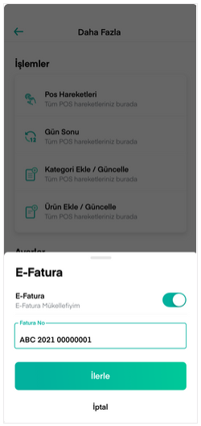

# E-belge Ayarları

Entegratör seçiminin yapıldığı ekrandır.

Entegratör seçimi yapıldıktan sonra mükellef olunan belge türü seçilir.

Ardından e-fatura numaranızı girmeniz istenir.

Üyeliğiniz varsa entegratör firma bilgileriniz kaydedebileceğiniz, yoksa başvuru adımına geçebileceğiniz ekran görüntülenir.

Bilgileriniz kaydedildikten sonra satış yapabilirsiniz.

Yanlış bilgi girişi durumunda bilgilendirilirsiniz.

Üye değilseniz ve Başvur butonuna bastıysanız gerekli bilgilendirme gösterilir.

