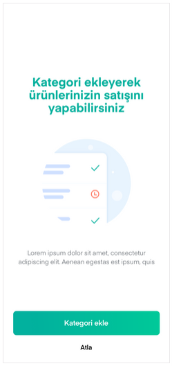
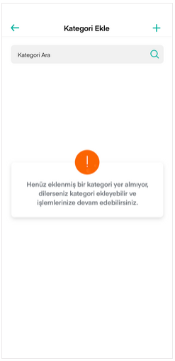
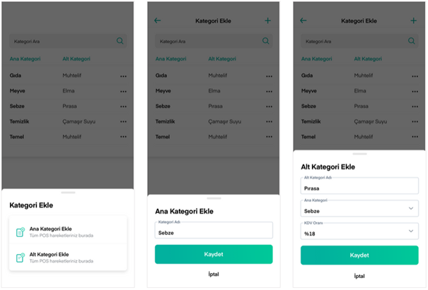
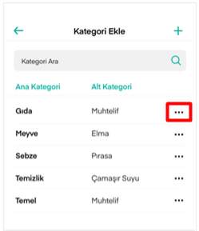
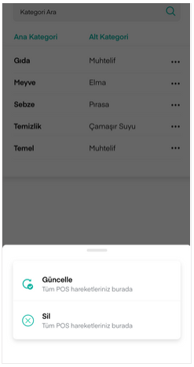
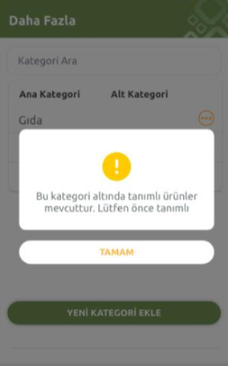

# Kategori Ekleme / Güncelleme

CebimPOS’ta ürün satışı yapabilmeniz için ürünlerinizi kategorilendirmeniz gerekir. Bunun için Daha Fazla ekranı içerisinden erişilebilen **Kategori Ekle / Güncelle** botunu aracılığıyla kategori ve alt kategoriler eklemelisiniz.

Kategori eklemediğinizde uyarı metni gösterilir. Uyarı ekranındaki **+** butonuna basarak da Kategori Ekle ekranına erişebilirsiniz.

**Kategori Ekle** ya da **+** butonuna bastığınızda Ana Kategori Ekle ve Alt Kategori Ekle seçenekleri çıkar. Gerekli seçimleri yaparak kategorilerinizi oluşturabilirsiniz. Ana kategori eklenmeden, alt kategori eklenememektedir \(Daha sonra ekleyeceğiniz ürünler, bu kategorilerin altında yer alır\).

**Kategori Ara** alanı eklenmiş kategoriler içerisinde arama yapmanızı sağlar.

Bir kategoride değişiklik yapmak ya da kategoriyi silmek için listeden ilgili kategori isminin yanındaki üç nokta ikonuna basılır.

Açılan ekrandan **Güncelle** butonuna bastığınızda kategori bilgilerini güncelleyebileceğiniz yeni bir ekran açılır ve güncellemelerinizi buradan yaparsınız.

Kategoriyi silmek için **Sil** butonuna basılır. Bu noktada sadece Ana Kategori silinecektir. Ana kategori silindiği zaman alt kategori de otomatik olarak silinir. Ancak silmek istediğiniz kategori altında tanımlı bir ürün varsa, önce bu ürün veya ürünlerin silinmesi gerektiğine dair uyarı metni ile bilgilendirilirsiniz. Ürünü sildikten sonra kategoriyi silebilirsiniz.

**Güncel uyarı metni:** Silmek istediğiniz kategori altında tanımlı ürün bulunmaktadır. Öncelikle ürünlerin silinmesi gerekmektedir.

