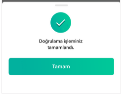

# Kullanıcı Doğrulama

Doğrulama için **Giriş** ekranındaki **Müşteri No**, **Şifre** ve **Kullanıcı Adı** alanları doldurulduktan sonra **Giriş** butonuna basılır. Bilgiler doğru ise **PIN Belirle** ekranı açılır.

Bu ekranda kayıtlı GSM numaranıza SMS ile gelen doğrulama kodu ve belirleyeceğiniz PIN girildikten sonra doğrulama işleminiz tamamlanır. Artık uygulamaya belirlediğiniz PIN ile giriş yapabilirsiniz.

