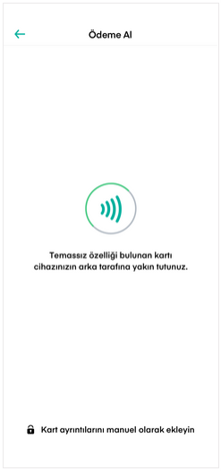

# Kartlı Ödeme

Kartlı ödemede bilgiler üç farklı yöntemle alınır.

NFC özelliği bulunan cep telefonları ile Temassız özelliği bulunan kartlardan ödeme alabilirsiniz. Bunun için kartınızı telefonunuza yakın tutmanız yeterlidir.

Kart ayrıntılarını elle de girebilirsiniz.

Yine kartlı ödemede kartınızı kameraya okutarak da ödeme yapabilirsiniz. Kartı okuttuktan sonra kart ayrıntılarını elle de girebilirsiniz.

Kredi kartı ile ödemelerde taksitli ödeme ve taksit ödeme seçenekleri de sunulmaktadır.

Son olarak kart bilgilerinizi elle girerek ödeme alabilirsiniz.

Ödeme bilgileri girildikten sonra Satışı Tamamla butonuna basılır ve güvenli ödeme seçenekleri kapsamında GSM numaranıza gönderilen doğrulama kodu girilerek satış tamamlanır.

Satış gerçekleştikten sonra satış belgenize de erişebilirsiniz.

