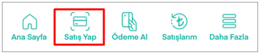
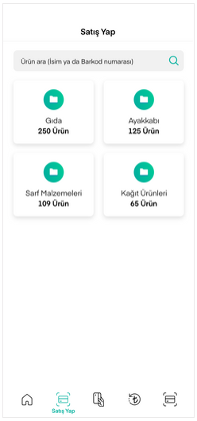
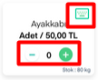
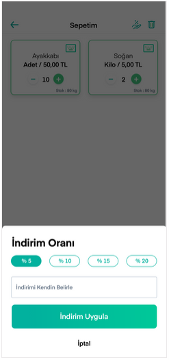

# Satış Yapma

CebimPOS’ta ürün satışı yapabilmeniz için öncelikle kategorilerinizin oluşturulmuş, ürünlerinizin eklenmiş olması gerekir. Ana Sayfa’daki **Satış Yap** butonu ile satış ekranlarına erişebilirsiniz.

Açılan **Satış Yap** ekranında kategoriler listelenir. **Ürün ara** alanından da istenen ürün; ismi ya da barkod numarası ile çağrılabilir.

Kategori seçimiyle birlikte seçilen kategori altındaki ürünler **Sık Satılanlar** ve **Tüm Ürünler** başlıkları altında stok miktarları görünecek şekilde listelenir. Stokta bulunmayan ürünler sepete eklenemez.

Değer girilen her ürün sepete eklenir. Değeri **+ / -** butonlarıyla veya klavye simgesine tıklayarak manuel girebilirsiniz.

Değer girilen her ürün, miktarınca sepete eklenir ve satışın devam etmesi için **Ödemeye Geç** butonuna basılır.

Ödeme aşamasında öncelikle üründe indirim uygulanıp uygulanmayacağının sorulduğu ekran görüntülenir. Bu ekranda otomatik tanımlanmış indirim oranlarını uygulayabilir ya da kendiniz indirim belirleyebilirsiniz.

İndirim uygularsanız indirimli fiyat, İptal seçeneğiyle indirim uygulamazsanız ürün normal fiyatı sonraki ekranda gösterilir. **Devam Et** butonuna basmanız durumunda ödeme aşamasına geçilir.

