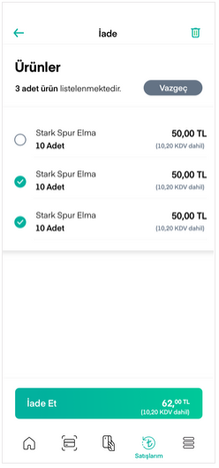

# Satışları Görüntüleme

Ana sayfadan erişilebilen Satışlarım ekranlarında tarih ve satış temsilcisi bazında filtreleme yapılarak satışlar görüntülenir.

Yine bu ekrandan satışları iade etme, satış detayını ve satış belgesini görüntüleme işlemleri gerçekleştirilebilir.

İade için iade edilecek satışlar seçilir ve **İade Et** butonuna basılır.

İadenin gerçekleşmeden toplam tutar ve iade tutarı satış detayında görünür.

İşlem teyidinin ardından iade gerçekleşir.

