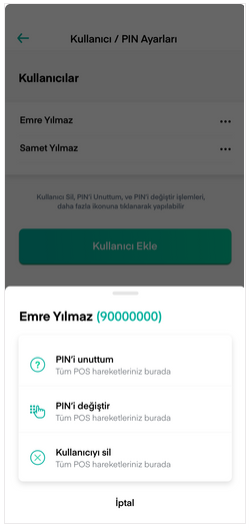

# PIN

Kullanıcıyı cihazınızda doğruladıktan sonra giriş için belirlediğiniz PIN’i girmeniz istenecektir.

PIN’i unutmanız ya da değiştirmek istemeniz durumunda **Kullanıcı / PIN Ayarları** butonundan ilgili adımları takip ederek işlemlerinizi gerçekleştirebilirsiniz.

