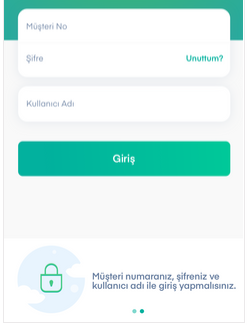

# Şifre

Şifreniz dijital kanallara giriş için kullandığınız Kuveyt Türk müşteri şifrenizdir. İlk şifrenizi Kuveyt Türk şubelerinden edinebilirsiniz. Şifrenizi hatırlamamanız ya da unutmanız durumunda uygulama giriş ekranındaki **Unuttum**, Kuveyt Türk mobil şube ve internet şubedeki **Şifremi Unuttum / Anında Şifre** butonuna basarak ya da **Kuveyt Türk Çağrı Merkezi 0850 251 0 123**’ü arayarak, şifre adımlarını takip edip yeni şifrenizi edinebilirsiniz.

