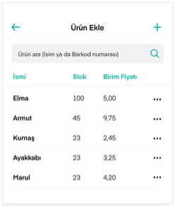
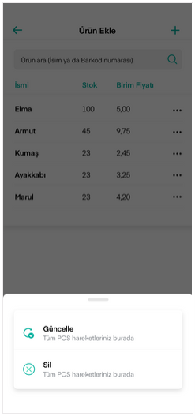

# Ürün Ekleme / Güncelleme

Daha Fazla ekranı içerisinden erişilebilen **Ürün Ekle / Güncelle** botunu ile ürün eklersiniz. Butona bastığınızda mevcut ürünlerinizin listelendiği ekran görünür.

Daha önce eklenmiş bir ürününüz yoksa liste boş gelecektir. **+** butonuna basarak ürün bilgisini ve detaylarını ekleyebilirsiniz. **Kaydet** butonuyla birlikte ürünü eklemiş olursunuz.

Eksik veya yanlış bilgi girdiğinizde ekran uyarılarıyla bilgilendirilirsiniz.

Bir üründe değişiklik yapmak ya da ürünü silmek için listeden ilgili ürün isminin yanındaki üç nokta ikonuna basılır.

Açılan ekrandan **Güncelle** butonuna bastığınızda ürün bilgilerini güncelleyebileceğiniz yeni bir ekran açılır ve güncellemelerinizi buradan yaparsınız.

Ürünü silmek için **Sil** butonuna basılır. Sistem size teyit mesajı çıkarır ve onaylamanız durumunda ürün silinmiş olur.

